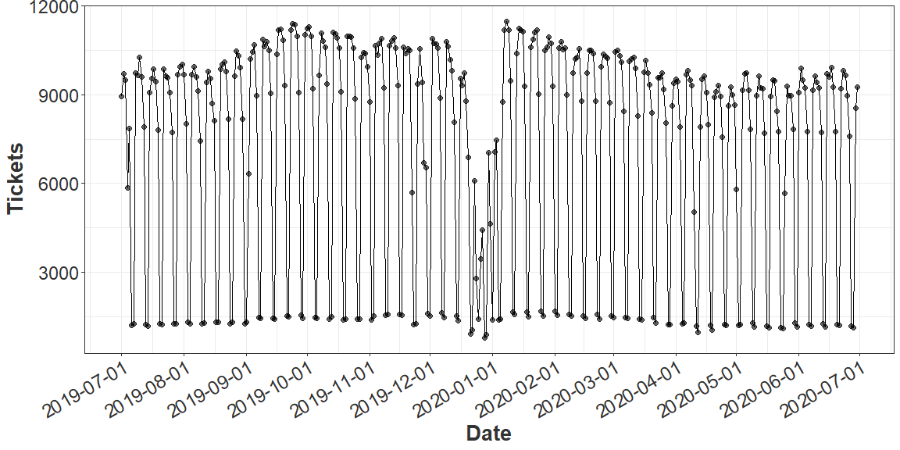

Our package is for double seasonal daily time seriers. Data features include outliers, variation increasing/decreasing, and double seasonality. We build multiplicative modeling for time series.

In this document, we explain how to use our R package. 

To showing the steps, we forecast the some airline supporting tickets for FY20 as an example.

## Install R package

Install the package from github


```r
devtools::install_github("placeboo/amplify", force = TRUE)
```
We start from loading our package `Amplify`.


```r
library(amplify)
```
We have support ticket from 2014-07-01 to 2018-06-10.
A glimpse of the data:
<div class="kable-table">

date          ticket
-----------  -------
2014-07-01      4540
2014-07-02      4547
2014-07-03      3888
2014-07-04      2172
2014-07-05       435
2014-07-06       486
2014-07-07      4411
2014-07-08      4475
2014-07-09      4183

</div>

In the package, we have a holiday data set. For forecasting, you can add your own holiday information. It should include the date and the name of the holidays. Have a look:


```r
data("holiday")
head(holiday)
```

<div class="kable-table">

date         name                      is_holiday   
-----------  ------------------------  -------------
2014-01-01   NewYear                   Yes          
2014-01-02   AfterNewYear1             AfterHoliday 
2014-01-03   AfterNewYear2             AfterHoliday 
2014-01-20   Martin Luther King Day    Yes          
2014-02-11   National Foundation Day   Yes          
2014-03-01   Carnival Saturday         Yes          

</div>


## Smoothing 

The whole data set is our training set. We aim to predict the daily tickets from 2019-07-01 to 2020-06-30. First we detect the outiers and impute them with reasonable value.


```r
smooth.ls = smooth_ts(data = tickets,
                      vars = c("date", "ticket"),
                      par = list(lambda = 1.5, s = 7))

train.dat = cbind(tickets, smooth.ls$ts.dat)
head(train.dat) 
```

<div class="kable-table">

date          ticket  is_outlier          ts
-----------  -------  -----------  ---------
2014-07-01      4540  no            4540.000
2014-07-02      4547  no            4547.000
2014-07-03      3888  no            3888.000
2014-07-04      2172  yes           3712.301
2014-07-05       435  no             435.000
2014-07-06       486  no             486.000

</div>

## Validation

We split the data set into subtraining set and validation set to find parameters.
There are 5 parameters $\{\alpha, \beta, \gamma, \omega, \phi\}$ in the model. We use grid search to find a set of optimal parameters. The searching process has been optimized by parallel computing. 


```r
train.start = 20140701
train.end = 20190630

subtrain.end = 20190430
valid.start = 20190501

valid.ls = train_test_split(train.dat,
                            train.window = c(train.start, subtrain.end),
                            test.window = c(valid.start, train.end))

subtrain.dat = valid.ls$train.dat
valid.dat = valid.ls$test.dat
```


```r
tic("grid search")
select.ls = select_model(train.y = subtrain.dat$ts,
                         valid.y = valid.dat$ts,
                         grid.search = TRUE,
                         search.length = c(-0.5, 0.5), 
                         length.out = 5)
toc()
```

```
## grid search: 105.2 sec elapsed
```

The list `select.ls` contains the model which has the smallest MAPE for validation set, and the validation resutls.


```r
cv = select.ls$cv
head(cv) 
```

<div class="kable-table">

     alpha       beta       gamma       omega         phi         me       rmse         mpe        mape
----------  ---------  ----------  ----------  ----------  ---------  ---------  ----------  ----------
 0.0413436   2.35e-05   0.0319544   0.1558890   0.0011155   144.2273   357.7416   0.0184198   0.0400901
 0.0206718   1.18e-05   0.0159772   0.0779445   0.0005577   187.4765   397.0671   0.0202587   0.0460451
 0.0206718   1.18e-05   0.0159772   0.0779445   0.0008366   187.4774   397.0681   0.0202588   0.0460452
 0.0206718   1.18e-05   0.0159772   0.0779445   0.0011155   187.4784   397.0691   0.0202589   0.0460453
 0.0206718   1.18e-05   0.0159772   0.0779445   0.0013943   187.4793   397.0701   0.0202590   0.0460454
 0.0206718   1.18e-05   0.0159772   0.0779445   0.0016732   187.4803   397.0711   0.0202591   0.0460455

</div>

We pick the parameters which yeild the lowest MAPE. 


```r
cv[which.min(cv$mape), ]
```

<div class="kable-table">

            alpha       beta       gamma       omega         phi         me       rmse         mpe        mape
-----  ----------  ---------  ----------  ----------  ----------  ---------  ---------  ----------  ----------
1872    0.0413436   3.53e-05   0.0479317   0.2338336   0.0005577   138.4206   347.6489   0.0215749   0.0380518

</div>

## Prediction

We first build a future data frame


```r
pred.dat = build_date(20190701, 20200630)
head(pred.dat) 
```

<div class="kable-table">

|date       |
|:----------|
|2019-07-01 |
|2019-07-02 |
|2019-07-03 |
|2019-07-04 |
|2019-07-05 |
|2019-07-06 |

</div>
Within the data frame, we fill the predicted tickets. 

```r
model = select.ls$model

pred.ls = forecast(model, h = nrow(pred.dat))
pred = as.numeric(pred.ls$mean)
pred.dat = pred.dat %>%
  mutate(pred = pred)

head(pred.dat) 
```

<div class="kable-table">

date              pred
-----------  ---------
2019-07-01    8939.624
2019-07-02    9699.908
2019-07-03    9506.293
2019-07-04    9297.721
2019-07-05    7869.112
2019-07-06    1192.328

</div>

## Holiday Modification

We define the distance between the actual and predictiona and then adjust the holidays.


```r
tmp = cbind(train.dat, pred = as.numeric(fitted(model)))
tmp = tmp %>%
  mutate(resid = (ticket - pred) / pred)
```

In order to capture floating holidays such as Easter, we add more information about Holidays. 


```r
modify.ls = modify_pred(tmp,
                        vars = c("date", "resid"),
                        time.window = c(20190701, 20200630),
                        par = list(lambda = 1.5, n = 3), 
                        holiday = holiday)

h.hat =  modify.ls$h.mat$h.hat
h.hat[h.hat > 0] = 0
pred.dat = pred.dat %>%
  mutate(h.hat = h.hat,
         pred_modify = pred * (1 + h.hat))
```


```r
pred.dat %>%
  ggplot(aes(x = date, y = pred_modify)) +
  geom_point(size = 2, alpha = 0.6) + 
  geom_line() +
  scale_x_date(name = "Date",
                date_breaks = "1 month") + 
  ylab("Tickets") + 
  theme(axis.text.x = element_text(angle = 30, hjust = 1))
```



